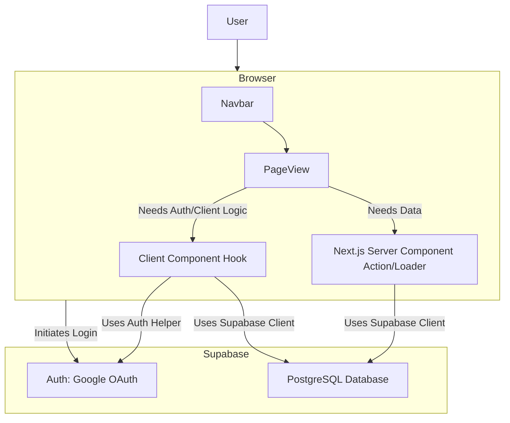

# System Patterns: Seamless BP

## 1. Architecture Overview
Seamless BP uses a modern web stack:
- **Frontend**: Next.js (App Router) hosted on Vercel. Handles UI, routing, and client-side data fetching.
- **Backend**: Supabase provides Backend-as-a-Service (BaaS).
- **Authentication**: Google OAuth managed via Supabase Auth.
- **Database**: Supabase PostgreSQL stores application data (projects, users, financials, timecards).
- **API Layer**: Implicitly handled via `@supabase/supabase-js` client library interacting directly with Supabase from Next.js (Server Components or Client Components).

## 2. Key Technical Decisions
- **Next.js App Router**: Leveraged for server components, routing, and overall structure.
- **Supabase**: Chosen for integrated Auth, DB, and ease of use, reducing backend overhead.
- **Tailwind CSS**: Utility-first CSS for rapid UI development.
- **Google OAuth**: Selected as the primary authentication method for simplicity for users.

## 3. Design Patterns (Likely)
- **Component-Based UI**: Standard React/Next.js pattern.
- **Server Components**: Used where possible for data fetching and rendering logic that doesn't require client-side interactivity.
- **Client Components**: Used for interactive UI elements and hooks (`useState`, `useEffect`).
- **Context API / State Management**: Potentially used for managing global state like user authentication status (`@supabase/auth-helpers-nextjs` often provides this).
- **Repository Pattern (Implicit)**: Supabase client library abstracts direct DB interactions.

## 4. Component/Data Flow (Simplified)

- **User Interaction**: User accesses the Next.js app on Vercel.
- **Authentication**: Login flow redirects to Google via Supabase Auth helper functions.
- **Navigation**: Navbar component likely controls routing between different page views (`dashboard`, `projects`, `finances`, etc.).
- **Data Fetching**: Pages fetch data from Supabase DB, primarily using Server Components where possible, or client-side fetching in Client Components if needed.
- **State**: Auth state managed via Supabase helpers; other state managed locally or via context/state management if required.
